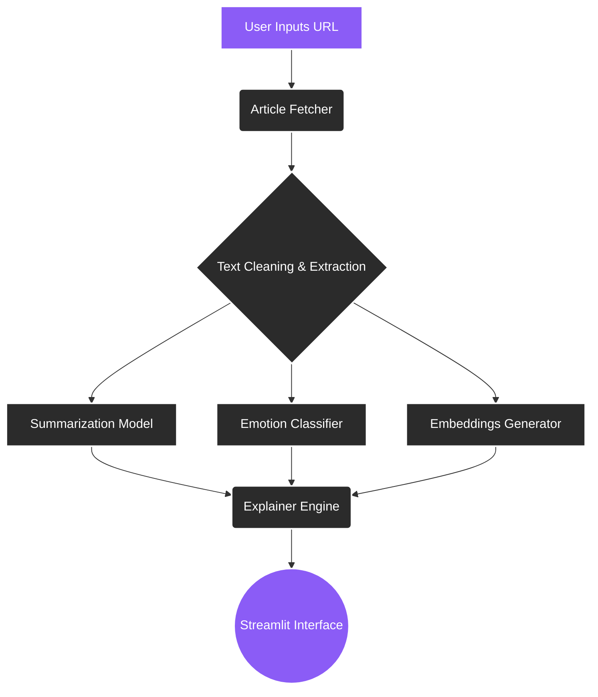

```markdown
# 🧠 Bias Lense

**See beyond the headline.** 

Bias Lense is an AI-powered web application designed to help users analyze how online articles use language, emotional framing, and tone to influence reader perception. By revealing the subtle layers behind the text, Bias Lense fosters critical reading, media literacy, and a deeper understanding of digital information.


---

## 📖 About Bias Lense

In the modern digital landscape, the way a story is told is often as impactful as the facts it contains. Emotional framing and specific language choices can significantly alter how a reader perceives a topic. 

Bias Lense addresses this challenge by providing an intuitive platform to evaluate online news and articles critically. Intended primarily for students, young adults, and anyone interested in media literacy, this application acts as a digital magnifying glass—highlighting emotional undertones, summarizing core facts, and explaining why an article might feel a certain way to the reader.

---

## ✨ Features

Bias Lense is built with a modular architecture to provide a seamless analytical experience:

*   **Article Analyzer (`analyzer_page.py`)**: Users can submit an article URL to receive an AI-assisted breakdown of its emotional tone and structural framing.
*   **Article Comparison (`comparison_page.py`)**: Submit two distinct article URLs to examine them side-by-side, revealing how different sources present the exact same topic.
*   **Automated Article Fetching (`src/article_fetcher.py`)**: Seamlessly retrieves and extracts clean text directly from user-provided URLs.
*   **Intelligent Summarization (`src/summarizer.py`)**: Condenses long-form journalism into digestible, easy-to-read summaries without losing core context.
*   **Emotion & Classification Engine (`src/classifier.py`)**: Scans the text to identify dominant emotional characteristics and framing techniques.
*   **Reasoning & Explanation (`src/explainer.py`)**: Doesn't just give a score—it provides contextual explanations for *why* the AI assigned a specific emotional or bias metric.
*   **Interactive Dashboard (`dashboard_page.py`)**: A centralized hub for tracking and visualizing analytical results.

---

## 🔍 How It Works

Bias Lense uses a streamlined pipeline to process raw web content into structured, actionable insights.



---

## 🤖 AI & NLP Architecture

The core logic of Bias Lense relies on several advanced Natural Language Processing (NLP) components, orchestrated through dedicated service modules:

* **Summarizer (`src/summarizer.py`)**: Utilizes a transformer-based summarization pipeline to extract the most critical sentences, ensuring users can grasp the core narrative before analyzing its bias.
* **Classifier (`src/classifier.py`)**: Powered by a PyTorch-based sequence classification model to detect emotional valence (e.g., anger, joy, fear) within the text.
* **Embeddings (`src/embeddings.py`)**: Generates high-dimensional vector representations of the text, allowing the system to mathematically measure the semantic similarity between two different articles.
* **Explainer (`src/explainer.py`)**: Translates the raw tensor outputs and logits from the models into human-readable rationale, demystifying the "black box" of the AI.

---

## 📰 Bias & Emotional Framing

**A Note on Objectivity:**
Bias Lense is an educational tool, not an absolute arbiter of truth. "Bias" is subjective, and an AI cannot definitively declare an article to be objectively biased. Instead, Bias Lense focuses on **indicators**:

* **Emotional Language:** Highlighting words designed to evoke a strong emotional response rather than presenting neutral facts.
* **Framing:** Identifying what information is emphasized and what is omitted.
* **Sentiment:** Gauging the overall positive, negative, or neutral trajectory of the text.

The goal is to provide users with the analytical data needed to form their own critical judgments.

---

## ⚖️ Article Comparison

The Comparison Mode (`comparison_page.py`) is the flagship feature for media analysis. By leveraging `comparison.py` and `comparison_service.py`, users can place two URLs side-by-side to uncover subtle narrative shifts.

**Conceptual Workflow:**

1. **Article A** and **Article B** are processed simultaneously.
2. The `embeddings.py` module calculates a similarity score to see how closely the facts align.
3. The `classifier.py` compares the emotional profiles (e.g., *Does Source A use fear-based framing while Source B remains neutral?*).
4. Results are displayed visually, allowing users to instantly spot discrepancies in media coverage.

---

## 🛠️ Tech Stack

### Frontend / Interface

* **Streamlit**: For rapid, data-driven web application deployment (`streamlit_app.py`).

### Programming & AI

* **Python**: Core application logic.
* **PyTorch**: Model inference and tensor management.
* **Hugging Face Transformers**: Tokenization, summarization pipelines, and emotion classification.

### Architecture

* **Modular Services**: Separation of concerns using a dedicated `src/services/` directory (`analysis_service.py`, `comparison_service.py`, `dataset_service.py`).

---

## 📁 Project Structure

```text
Bias-Lense/
├── .gitignore               # Git ignore rules
├── README.md                # Project documentation
├── requirements.txt         # Python dependencies
├── streamlit_app.py         # Main application entry point
│
├── notebooks/               
│   └── cnn_demo.ipynb       # Jupyter notebook for model demonstration/testing
│
├── pages/                   # Streamlit UI Views
│   ├── __init__.py         
│   ├── analyzer_page.py     # Single article analysis interface
│   ├── comparison_page.py   # Dual article comparison interface
│   └── dashboard_page.py    # Main dashboard interface
│
└── src/                     # Core Backend Logic
    ├── __init__.py         
    ├── app.py               # Application configuration
    ├── article_fetcher.py   # Web scraping and text extraction
    ├── classifier.py        # Emotion and bias classification models
    ├── comparison.py        # Core comparison algorithms
    ├── embeddings.py        # Semantic text embedding generation
    ├── explainer.py         # AI reasoning generation
    ├── summarizer.py        # Transformer summarization pipelines
    │
    └── services/            # Orchestration Layer
        ├── __init__.py     
        ├── analysis_service.py    # Manages the analysis workflow
        ├── comparison_service.py  # Manages the comparison workflow
        └── dataset_service.py     # Data handling and processing

```

---

## 🚀 Installation

To run Bias Lense locally, follow these steps:

**1. Clone the repository**

```bash
git clone [https://github.com/totevgeorgi/biase-lense.git](https://github.com/totevgeorgi/biase-lense.git)
cd biase-lense

```

**2. Create and activate a virtual environment**

```bash
# On Windows
python -m venv venv
venv\Scripts\activate

# On macOS/Linux
python3 -m venv venv
source venv/bin/activate

```

**3. Install dependencies**

```bash
pip install -r requirements.txt

```

**4. Run the application**

```bash
streamlit run streamlit_app.py

```

*Note: The first time you run the application, it may take a few minutes to download the necessary NLP models and weights to your local machine.*

```

```
